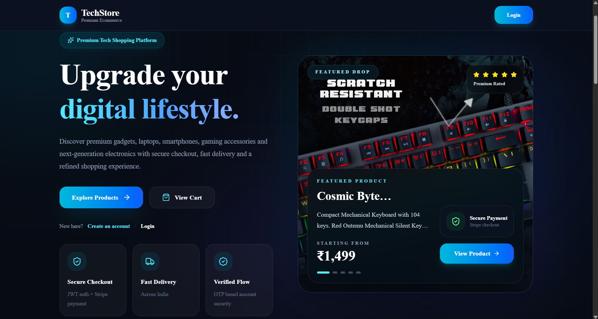
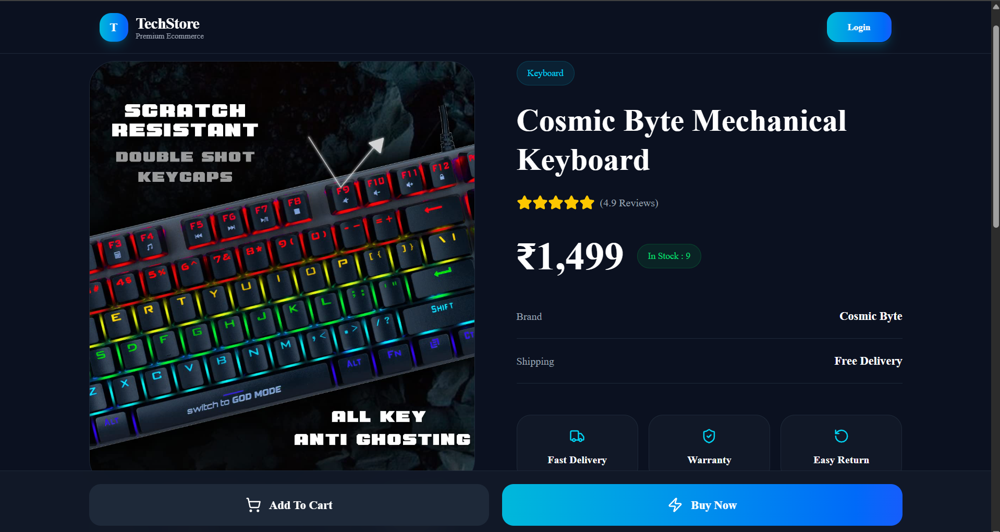
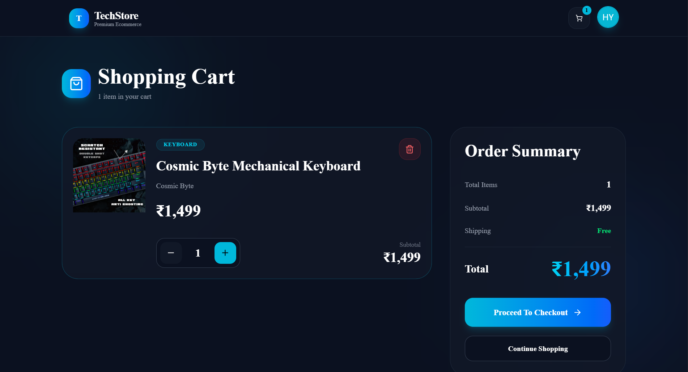
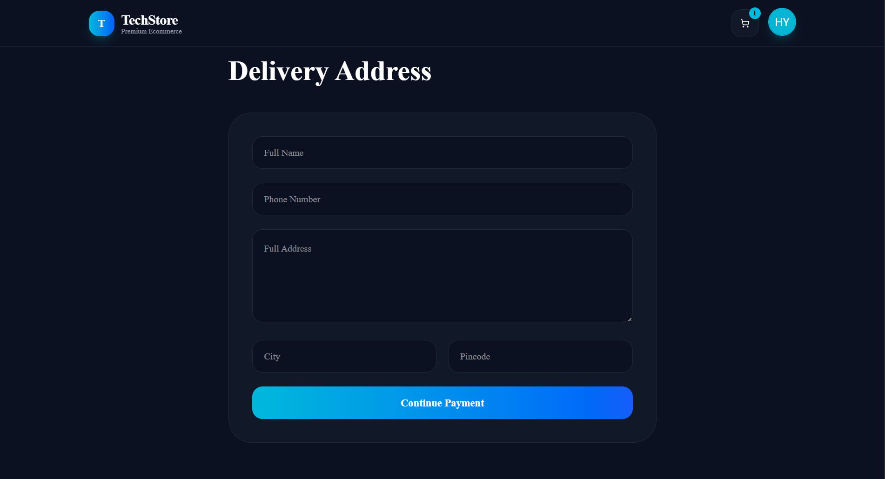
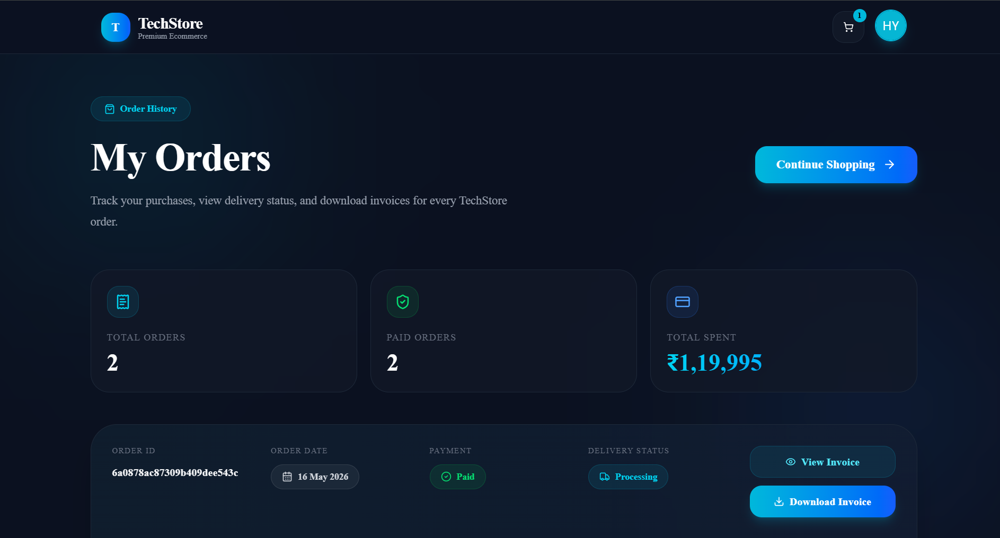

# TechStore MERN - Full Stack E-Commerce Platform

TechStore MERN is a modern full-stack e-commerce web application built with **Next.js, TypeScript, MongoDB, Stripe, Tailwind CSS, and Cloudinary**.  
It includes a complete shopping flow for users and a dedicated admin panel for managing products, orders, and users.

---

## Live Demo

```txt
https://tech-store-mern.vercel.app
```

---

## Demo Credentials


### User

```txt
Email: user@techstore.com
Password: Qwer@1234
```

> These credentials are for demo/testing only.

---

## Features

### User Features

- User registration and login
- JWT-based authentication
- Browse products
- Product details page
- Product search
- Add to cart
- Update cart quantity
- Remove items from cart
- Delivery address form
- Stripe payment checkout
- View order history
- Download invoice PDF
- Responsive UI

### Admin Features

- Admin dashboard
- Add products
- Edit products
- Delete products
- Upload product images
- View all orders
- View order details
- Manage users
- Block users
- Delete users
- Role-based access control

---

## Tech Stack

- Next.js
- React.js
- TypeScript
- MongoDB
- Mongoose
- Tailwind CSS
- Shadcn UI
- Stripe
- Cloudinary
- JWT
- Bcrypt
- Nodemailer
- Axios
- Sonner

---

## Screenshots
### Screenshots use demo data. Sensitive customer, payment, and address details are hidden for privacy.
Create a folder:

```txt
public/screenshots
```

Add your screenshots using the names below.

---

## User Side Screenshots

### Home Page



### Product Details



### Cart Page



### Checkout Page



### Orders Page




---

## Environment Variables

Create a `.env.local` file in the root folder and add:

```env
MONGODB_URI=your_mongodb_connection_string
JWT_SECRET=your_jwt_secret

NEXT_PUBLIC_APP_URL=http://localhost:3000

For production:
NEXT_PUBLIC_APP_URL=https://tech-store-mern.vercel.app

STRIPE_SECRET_KEY=your_stripe_secret_key
STRIPE_WEBHOOK_SECRET=your_stripe_webhook_secret

CLOUDINARY_CLOUD_NAME=your_cloudinary_cloud_name
CLOUDINARY_API_KEY=your_cloudinary_api_key
CLOUDINARY_API_SECRET=your_cloudinary_api_secret

EMAIL_USER=your_email
EMAIL_PASS=your_email_app_password
```

---

## Installation

Clone the repository:

```bash
git clone https://github.com/harshrajsinhvaghela7586/TechStore-MERN.git
```

Go to the project folder:

```bash
cd techstore-mern
```

Install dependencies:

```bash
npm install
```

Run the development server:

```bash
npm run dev
```

Open in browser:

```txt
http://localhost:3000
```

---

## Build

```bash
npm run build
```

Run production server:

```bash
npm start
```

---

## Deployment

The project can be deployed on **Vercel**.

Basic deployment steps:

1. Push code to GitHub
2. Import repository in Vercel
3. Add environment variables
4. Deploy the project
5. Add Stripe webhook URL in Stripe Dashboard

---

## Stripe Webhook

For local testing:

```bash
stripe listen --forward-to localhost:3000/api/webhooks/stripe
```

For production, add this webhook URL in Stripe Dashboard:

```txt
https://your-domain.vercel.app/api/webhooks/stripe
```

---

## Project Status

```txt
Completed - Production Ready MVP
```

---

## Author

```txt
Harshrajsinh Vaghela
MERN Stack Developer
```
